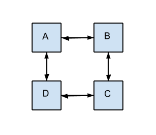

# aMAZEing Recursion 

## Overview
For this assignment, you will be implementing yet another Linked List data structure. However, this time all the methods must be recursive. In addition to this, you will be writing a framework for creating and solving mazes.

### Table of Contents
**[Files to complete](#files-to-complete)**<br>
**[Support Code API](#support-code-api)**<br>
**[Part One: Import Project](#part-one-import-project)**<br>
**[Part Two: Implementing ListInterface](#part-two-implementing-listinterface)**<br>
**[Part Three: Implement a Maze Builder](#part-three-implement-a-maze-builder)**<br>
**[Part Four: Write a Maze Solver](#part-four-write-a-maze-solver)**<br>

## Book
This assignment is based off Chapter 6 and Chapter 7 in the Java Software Structures book.

## Files to complete
You are expected write an implementation for each of the classes listed in `config.Configuration`. As with the last assignment, you must specify which implementation you would like to be graded in this file.

It will almost certainly be useful for you to write additional class files. Any class file you write that is used by your solution must be in the provided src folder (unless you are going for a bonus).

Note: You may not use any of the provided Collection classes provided by the java standard API. A list of them can be seen in the “All Known Subinterfaces” and “All Known Implementing Classes” of the following URL: http://docs.oracle.com/javase/8/docs/api/java/util/Collection.html

### Test files
In the test folder, you are provided with several JUnit test cases that will help you keep on track while completing this assignment. I recommend you run the tests often and use them as a checklist of things to do next. You may add your own tests to these files if you wish.

### Support Code API
The Support Code’s comments have been generated into a nicely formatted API that can be found here: 

https://jd12.github.io/amazeing-student/

It is highly recommended that you spend some time reading over the comments in each of the interfaces and classes provided:

**structure.ListInterface - An interface for a List<br>
maze.Maze - A class that represents a Maze<br>
maze.MazeBuilder - An interface providing a set of methods for managing the rooms in a maze<br>
maze.MazeSolution - An interface describing a solution to a maze<br>
maze.Room - An interface describing a Room in a maze<br>
maze.UnsolvableMazeException - An exception that is thrown when a maze cannot be solved**


## Part One: Import Project 
When you clone / download your project from GitHub Classroom, you will want to ensure that your project should have no errors and contain the following root items:

**src** - The source folder where all code you are submitting must go. You can change anything you want in this folder, you can add new files, etc...<br>
**test** - The test folder where all the public unit tests are available<br>
**support** - This folder contains support code that I encourage you to use (and must be used to pass certain tests). Be very careful if you choose to change files in this folder.<br>
**JUnit 5** - A library that is used to run the test programs<br>
**JRE System Library** - This is what allows java to run<br>

If you are missing any of the above or errors are present in the project, seek help immediately, so you can get started on the project right away.


## Part Two: Implementing ListInterface
Start off by implementing the ListInterface provided. Unlike previous lists you’ve created, in this one you may not use loops of any kind. Be sure to pay close attention to the big-O running times. You will not pass all the tests if you do not adhere to these running times.

As a general rule, you can access one end of the list directly, and you have to slink your way through to get to the other end of the list. Along those lines, the `Node` class is in the support module, with the intent that you will keep the list singly-linked. The big-O restrictions correspond to that.

**Hints:** Recursion is all about reducing some problem slightly to make it easier to solve. Ask yourself, “What method would make this easier?” For example, the contains method signature is written in a way that it is not going to be possible to do recursion on a `Node`. However, there is nothing stopping us from writing a private method that we can use internally. It sure would be great if we had a method that had this signature:

```
private int contains(T toFind, Node<T> toCheck, int currentIndex);
```

We can then simply ask, does `toCheck` hold `toFind`? If it does, we can return `currentIndex`. Otherwise, we recurse on the next node in the list, at the next index, with the same `toFind` value. What should we do if `toCheck` is null?

Try and come up with good “helper” methods that lend themselves to recursion. You can’t modify the interface, but that does not stop you from adding new methods.


## Part Three: Implement a Maze Builder
Take a look at the `Room` and `MazeBuilder` interfaces. Although there are no tests for `Room`(feel free to add test cases if you like), you will need some kind of class to generate these. Once you have a basic class for this, implement your `MazeBuilder`. Start with the easy methods `createRoom` and `createExit`. These should simply return new instances of the `Room` type you just made.

Now, try to add the `addOneWayPassage` method. This method takes in a `fromRoom` and `toRoom`. Then, this method should update the `fromRoom` to contain the `toRoom`. Basically, you’re adding a one way passage. In a maze this could be seen as falling through a hole or walking through a room where a portcullis falls behind you. Make sure to read the documentation to ensure that you are implementing everything right. What should happen if we add the same `toRoom` more than one time?

Now that we have `addOneWayPassage` written, write the `addPassage` method. Is there an elegant way to reuse some of the code we’ve already written? **(Hint: Yes, and you don’t even have to use copy / paste!)**


## Part Four: Write a Maze Solver
Okay. This is the hard part. Let's go!

There is an elegant recursive solution to solving a maze. To get started, we will write a method that instead just tells us if the maze can be solved.

We’ll define this method as follows:

```
boolean canBeSolved(Room r);
```

We have a pretty simple base case: If `r.isExit()` then we should return true because we can solve the maze.

In the situation where `r` is not an exit, we know that it `canBeSolved` if one of the rooms we can reach from `r` `canBeSolved`. So, we can recurse on each of the rooms in `r.getRooms()`.

However, what is going to happen in the following maze:



Let’s say we start in room A. We check and room A is not an exit. So we recur on room B. We see that B is not an exit, and then we recur on room A. We see that room A is not an exit, so we recur on room B. We see that B is not an exit, and we recur on room A. Uh oh! We are going to get a stack overflow.

We need to come up with some way to mark the places we’ve already visited. If we have visited a location, we know that we should not recur on it. Take a look at the methods you implemented in the `ListInterface`. Can any of these help us?

After you finish the `canBeSolved` method, you need to translate this to an algorithm that returns a `List` of rooms to visit for the solution.
